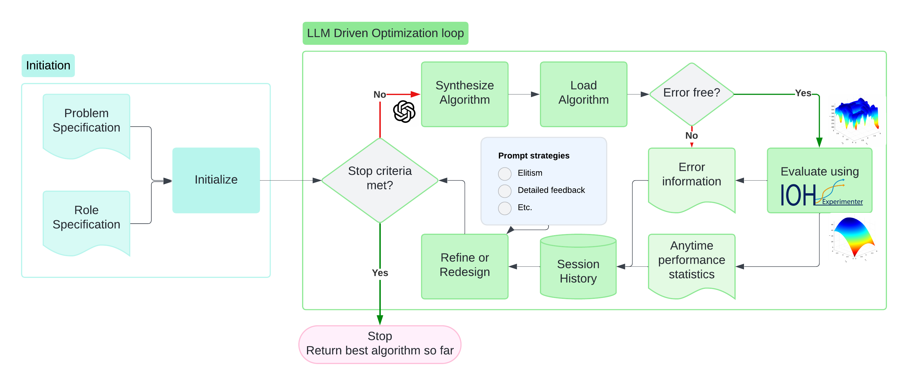
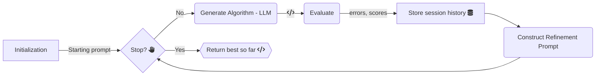

<p align="center">
  <picture>
    <source media="(prefers-color-scheme: dark)" srcset="logo-dark.png">
    <source media="(prefers-color-scheme: light)" srcset="logo.png">
    
  </picture>
</p>

<h1 align="center">LLaMEA: Large Language Model Evolutionary Algorithm</h1>

<p align="center">
  <a href="https://pypi.org/project/llamea/">
    
  </a>
  <a href="https://codecov.io/gh/nikivanstein/LLaMEA" > 
     
  </a>
</p>

## Table of Contents
- [Introduction](#introduction)
- [Installation](#installation)
- [Contributing](#contributing)
- [Citation](#citation)
- [License](#license)

## Introduction

LLaMEA (Large Language Model Evolutionary Algorithm) is an innovative framework that leverages the power of large language models (LLMs) such as GPT-4 for the automated generation and refinement of metaheuristic optimization algorithms. The framework utilizes a novel approach to evolve and optimize algorithms iteratively based on performance metrics and runtime evaluations without requiring extensive prior algorithmic knowledge. This makes LLaMEA an ideal tool for both research and practical applications in fields where optimization is crucial.

## Features

<p align="center">
  
</p>


- **Automated Algorithm Generation**: Automatically generates and refines algorithms using GPT models.
- **Performance Evaluation**: Integrates with the IOHexperimenter for real-time performance feedback, guiding the evolutionary process to generate metaheuristic optimization algorithms.
- **Customizable Evolution Strategies**: Supports configuration of evolutionary strategies to explore algorithmic design spaces effectively.
- **Extensible and Modular**: Designed to be flexible, allowing users to integrate other models and evaluation tools.


## Getting Started

### Prerequisites

- Python 3.8 or later
- OpenAI API key for accessing GPT models

### Installation

It is the easiest to use LLaMEA from the pypi package.

```bash
  pip install llamea
```

You can also install the package from source using Poetry.

1. Clone the repository:
   ```bash
   git clone https://github.com/nikivanstein/LLaMEA.git
   cd LLaMEA
   ```
2. Install the required dependencies via Poetry:
   ```bash
   poetry install
   ```

### How to use

1. Set up an OpenAI API key:
   - Obtain an API key from [OpenAI](https://openai.com/).
   - Set the API key in your environment variables:
     ```bash
     export OPENAI_API_KEY='your_api_key_here'
     ```

2. Running an Experiment

    To run an optimization experiment using LLaMEA:

    ```python
    from llamea import LLaMEA

    # Define your evaluation function
    def your_evaluation_function(solution):
        # Implementation of your function
        # return feedback, quality score, error information
        return "feedback for LLM", 0.1, ""

    # Initialize LLaMEA with your API key and other parameters
    optimizer = LLaMEA(f=your_evaluation_function, api_key="your_api_key_here")

    # Run the optimizer
    best_solution, best_fitness = optimizer.run()
    print(f"Best Solution: {best_solution}, Fitness: {best_fitness}")
    ```

## Contributing

Contributions to LLaMEA are welcome! Here are a few ways you can help:

- **Report Bugs**: Use [GitHub Issues](https://github.com/nikivanstein/LLaMEA/issues) to report bugs.
- **Feature Requests**: Suggest new features or improvements.
- **Pull Requests**: Submit PRs for bug fixes or feature additions.

Please refer to CONTRIBUTING.md for more details on contributing guidelines.

## License

Distributed under the [MIT](https://choosealicense.com/licenses/mit/) License. See `LICENSE` for more information.


## Citation

If you use LLaMEA in your research, please consider citing the associated paper:

```bibtex
@misc{vanstein2024llamea,
      title={LLaMEA: A Large Language Model Evolutionary Algorithm for Automatically Generating Metaheuristics}, 
      author={Niki van Stein and Thomas Bäck},
      year={2024},
      eprint={2405.20132},
      archivePrefix={arXiv},
      primaryClass={cs.NE}
}
```

---

For more details, please refer to the documentation and tutorials available in the repository.



---

CodeCov test coverage

 

